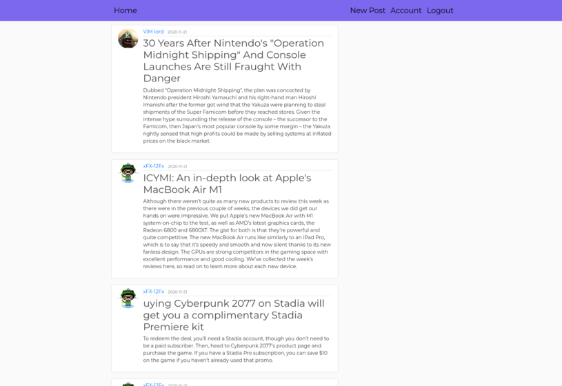

# Flask blog


Flask blog pet project

## Stack used

Python + Flask + Bootstrap

## Installation

```cs
python3 -m venv py3Env
source py3Env/bin/activate
pip3 install -r requirements.txt
python run.py
http://localhost:5000/
```

## User login info

```cs
VIM_lord@gmail.com
12345678
```

```cs
xFX-12Fx@gmail.com
12345678
```

## Author

IURII LYTVYN

## License

[MIT](https://choosealicense.com/licenses/mit/)
